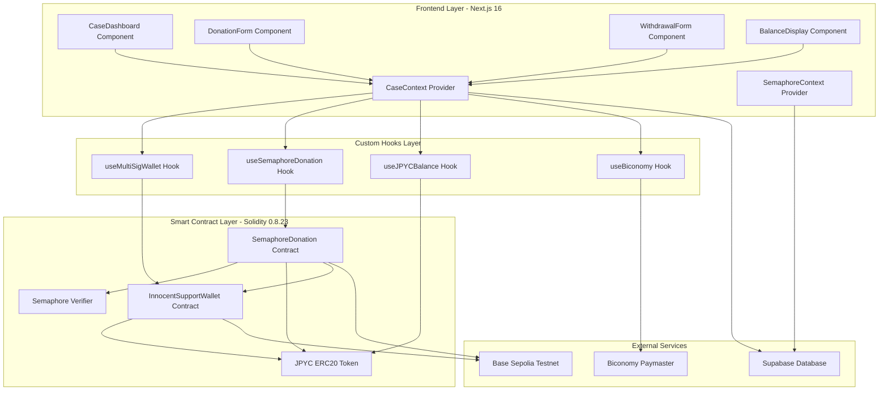
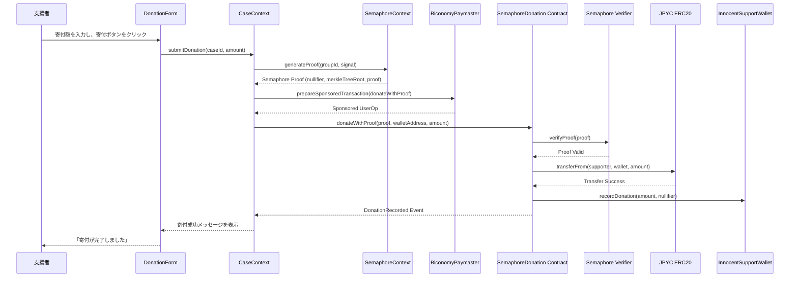
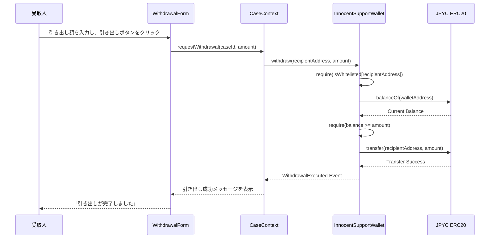
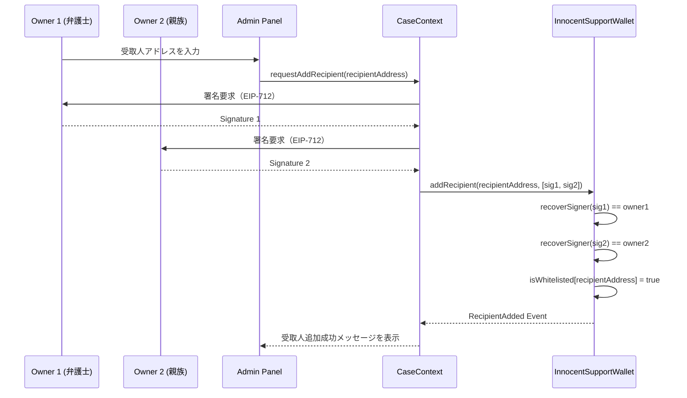

# Design Document: Innocence Ledger MVP

---

## Overview

**Purpose**: Innocence Ledger MVP は、ブロックチェーン技術（MultiSig Wallet + Semaphore v4 ZKP + JPYC）を活用し、冤罪被害者への**透明性のある資金支援インフラ**を提供します。支援者は匿名性を保ちながらJPYC（円建てステーブルコイン）で寄付を実行し、資金の流れはオンチェーンで完全に追跡可能です。MultiSig Wallet により、弁護士と親族の2署名承認による安全な資金管理を実現します。

**Users**:

- **支援を受ける側**: 冤罪被害者（無罪確定後）、有罪判決を受けたが無罪を主張する被収容者
- **支援する側**: 個人支援者（国内・海外）、親族、冤罪支援に関心のある市民
- **ケース管理者**: 弁護士、親族（MultiSig Wallet の Owner として資金管理と受取人設定を実行）

**Impact**: 既存の Semaphore フィードバック機能（`pkgs/contracts/contracts/Feedback.sol`）と Biconomy AA インフラを再利用し、新規 MultiSig Wallet コントラクトとケース管理フロントエンドを追加することで、冤罪支援プラットフォームの MVP を構築します。

### Goals

- **透明性の確保**: オンチェーンで寄付履歴・引き出し履歴をすべて記録し、誰でも検証可能にする
- **匿名性の保証**: Semaphore v4 ZKP により、支援者の実アドレスを公開せず、グループメンバーシップ証明のみで寄付を実行
- **安全な資金管理**: MultiSig Wallet（2-of-2 署名）により、弁護士と親族の合意がない限り受取人を変更できない仕組みを構築
- **ガスレス UX**: Biconomy Paymaster によるガスレス実行で、支援者の UX を向上
- **JPYC 統合**: Base Sepolia テストネット上の JPYC（ERC20）を使用し、円建て寄付を実現

### Non-Goals

- **法的判断・冤罪の事実認定**: プラットフォームは資金インフラを提供するのみで、冤罪の判定は行わない
- **実運用での資金管理**: MVP はテストネット（Base Sepolia）でのプロトタイプであり、本番環境での運用は将来フェーズで検討
- **複雑な受取人管理**: MVP では受取人のホワイトリスト管理のみを実装し、段階的な資金ロック解除機能は実装しない
- **マルチチェーン対応**: MVP では Base Sepolia のみをサポートし、他チェーンへの展開は将来フェーズで検討

---

## Architecture

### Existing Architecture Analysis

**既存アーキテクチャの概要**:

- **Semaphore フィードバック機能**: `pkgs/contracts/contracts/Feedback.sol` により、匿名フィードバックを Semaphore v4 で実装済み
- **Biconomy Account Abstraction**: `pkgs/web-app/hooks/useBiconomy.ts` により、ガスレストランザクションを実現
- **Privy 認証**: `pkgs/web-app/providers/index.tsx` により、ソーシャルログインと埋め込みウォレットを提供
- **Supabase バックエンド**: ユーザーデータと Semaphore Identity を暗号化保存
- **Next.js 16 App Router**: `pkgs/web-app/app/` 配下でフィードバック UI を実装

**保持すべきパターンと制約**:

- Semaphore v4 の Identity 管理パターン（暗号化保存、オフチェーンメンバーシップ証明生成）
- Biconomy AA による Paymaster パターン（スマートコントラクト実行のガス代を Paymaster が負担）
- Privy のソーシャル認証フロー（`@privy-io/react-auth` の `usePrivy` フック）
- viem v2.43.4 によるコントラクトインタラクション（フロントエンドでは ethers.js を使用しない）

**統合ポイント**:

- 新規 MultiSig Wallet コントラクトを既存の Semaphore グループと統合
- 既存の `SemaphoreContext.tsx` を拡張し、新規 `CaseContext.tsx` でケース管理状態を追加
- Biconomy Paymaster を MultiSig Wallet および Semaphore 寄付機能で再利用

**技術的負債**:

- 既存の Feedback.sol は今回の MultiSig Wallet 機能とは独立しており、そのまま保持
- 将来的に、Feedback 機能と Innocence Ledger 機能を統合したダッシュボードを検討

### Architecture Pattern & Boundary Map

**Selected Pattern**: **Hybrid Approach**（gap-analysis.md Option C）

**Architecture Integration**:

- 既存の Semaphore フィードバック機能と並行して、新規 MultiSig Wallet + ケース管理機能を実装
- ドメイン境界を明確化するため、MultiSig Wallet は独立したコントラクトとして実装し、Semaphore グループとは外部参照で統合
- フロントエンドでは、フィードバック機能とケース管理機能を別々の Context（`SemaphoreContext`, `CaseContext`）で管理し、ルーティングで分離
- Biconomy AA と Privy 認証は、両機能で共通のインフラとして再利用

**Component Boundary Diagram**:



**Key Decisions**:

- **ドメイン境界**: MultiSig Wallet 機能（InnocentSupportWallet）と Semaphore 寄付機能（SemaphoreDonation）を分離し、責任範囲を明確化
- **既存パターンの保持**: SemaphoreContext は既存のフィードバック機能で使用し、CaseContext は新規ケース管理機能で使用
- **Biconomy AA の再利用**: useBiconomy フックを両機能で共通化し、ガスレス実行を実現
- **Steering 準拠**: viem のみを使用し、ethers.js は使用しない（tech.md の要件）

### Technology Stack

| Layer                   | Choice / Version                     | Role in Feature                                                               | Notes                                                               |
| ----------------------- | ------------------------------------ | ----------------------------------------------------------------------------- | ------------------------------------------------------------------- |
| Frontend / CLI          | Next.js 16 App Router                | ケースダッシュボード、寄付フォーム、引き出しフォームの UI 実装                | 既存プロジェクトと同じ App Router パターンを使用                    |
| Frontend Library        | React 19                             | コンポーネントベースの UI 開発                                                | Server Components と Client Components を適切に分離                 |
| Web3 Library (Frontend) | viem v2.43.4                         | コントラクトインタラクション、ウォレット接続、トランザクション送信            | ethers.js は使用しない（steering/tech.md の要件）                   |
| Authentication          | Privy (`@privy-io/react-auth`)       | ソーシャルログイン、埋め込みウォレット管理                                    | 既存の Privy 統合パターンを再利用                                   |
| Account Abstraction     | Biconomy AA SDK                      | ガスレストランザクション（Paymaster パターン）                                | 既存の useBiconomy フックを再利用                                   |
| Smart Contract          | Solidity 0.8.23                      | MultiSig Wallet（InnocentSupportWallet）、Semaphore 寄付（SemaphoreDonation） | OpenZeppelin 5.x 依存、Hardhat でデプロイ                           |
| ZKP Protocol            | Semaphore v4                         | 匿名グループメンバーシップ証明、支援者のプライバシー保護                      | 既存の Feedback.sol と同じ Semaphore バージョンを使用               |
| Stablecoin              | JPYC (ERC20)                         | 円建て寄付・引き出し                                                          | Base Sepolia アドレス: `0xda683fe053b4344F3Aa5Db6Cbaf3046F7755e5E1` |
| Signature Verification  | OpenZeppelin ECDSA + EIP712          | MultiSig Owner の署名検証、受取人ホワイトリスト管理                           | `_hashTypedDataV4` と `ECDSA.recover` を使用                        |
| Backend / Database      | Supabase                             | ケース情報、Semaphore Identity の暗号化保存                                   | 既存の Supabase インスタンスを再利用                                |
| Testing Framework       | Hardhat + Chai + ethers v6 (backend) | スマートコントラクトのユニットテスト・統合テスト                              | Hardhat 環境では ethers v6 を使用（steering/tech.md の許可範囲内）  |
| Testing Framework (UI)  | Vitest + React Testing Library       | フロントエンドコンポーネントのテスト                                          | 既存のテスト環境を再利用                                            |
| Deployment Network      | Base Sepolia Testnet                 | MVP のデプロイ先（テストネット）                                              | 本番環境は将来フェーズで Base Mainnet へ移行                        |

**Rationale**:

- **viem**: フロントエンドの標準ライブラリとして、バンドルサイズが小さく、TypeScript 型安全性が高い
- **Semaphore v4**: 既存のフィードバック機能と同じバージョンを使用し、グループ管理ロジックを再利用
- **OpenZeppelin 5.x**: Solidity 0.8.23 に対応し、EIP712 + ECDSA のユーティリティを提供
- **JPYC**: Base Sepolia でテスト可能な円建てステーブルコイン（プロダクションアドレス確定済み）
- **Biconomy AA**: 既存の useBiconomy フックを再利用し、開発コストを削減

詳細な調査結果と技術選定の根拠は `research.md` を参照してください。

---

## System Flows

### Flow 1: 匿名寄付フロー（Semaphore Proof + JPYC Transfer）



**Key Decisions**:

- Semaphore Proof の生成はフロントエンドで実施し、オンチェーンでは Verifier による検証のみを実行
- JPYC の `approve` + `transferFrom` パターンを使用し、支援者のウォレットから MultiSig Wallet へ直接送金
- Biconomy Paymaster により、支援者はガス代を支払わずに寄付を実行可能

### Flow 2: 資金引き出しフロー（Whitelist Verification + JPYC Transfer）



**Key Decisions**:

- 引き出しは受取人のアドレスがホワイトリストに含まれる場合のみ実行可能
- ホワイトリストへの追加は、MultiSig Owner（弁護士・親族）の2署名検証を経て実施（Flow 3 参照）

### Flow 3: 受取人ホワイトリスト追加フロー（MultiSig Signature Verification）



**Key Decisions**:

- EIP-712 型付き署名により、署名対象データ（受取人アドレス、nonce、ドメインセパレーター）を明確化
- OpenZeppelin の `ECDSA.recover` により、署名者のアドレスを復元し、Owner リストと照合
- 2署名の順序検証（`signer1 < signer2`）により、重複署名を排除

---

## Requirements Traceability

| Requirement | Summary                                       | Components                                               | Interfaces                                 | Flows                |
| ----------- | --------------------------------------------- | -------------------------------------------------------- | ------------------------------------------ | -------------------- |
| 1           | MultiSig Wallet 作成と Semaphore グループ統合 | InnocentSupportWallet, CaseContext, Supabase Schema      | createCase API, ISupportWalletService      | N/A (1回のみ実行)    |
| 2           | 匿名寄付機能（JPYC + Semaphore 統合）         | SemaphoreDonation, DonationForm, useSemaphoreDonation    | IDonationService, donateWithProof method   | Flow 1               |
| 3           | 受取人ホワイトリスト設定（署名検証ベース）    | InnocentSupportWallet, useMultiSigWallet                 | addRecipient method, IWhitelistService     | Flow 3               |
| 4           | 寄付金受け取り機能                            | InnocentSupportWallet, WithdrawalForm, useMultiSigWallet | withdraw method, IWithdrawalService        | Flow 2               |
| 5           | ウォレット残高表示機能                        | BalanceDisplay, useJPYCBalance                           | IBalanceService, getBalance method         | N/A (リードオンリー) |
| 6           | 支援ケースダッシュボード表示                  | CaseDashboard, CaseContext, Supabase Schema              | getCases API, IDashboardService            | N/A (リードオンリー) |
| 7           | セキュリティとアクセス制御                    | 全コントラクト（Modifier: onlyOwner, onlyWhitelisted）   | N/A (全 Interface に横断的に適用)          | All Flows            |
| 8           | JPYC 統合と ERC20 準拠                        | useJPYCBalance, SemaphoreDonation, InnocentSupportWallet | IERC20, transfer/approve/balanceOf methods | Flow 1, Flow 2       |
| 9           | エラーハンドリングとユーザーフィードバック    | CaseContext, ErrorBoundary, ToastNotification            | IErrorHandler, displayError method         | All Flows            |
| 10          | テストネット環境とデプロイ                    | Hardhat Deploy Scripts, Environment Config               | N/A (デプロイスクリプト)                   | N/A                  |

---

## Components and Interfaces

### Component Summary

| Component             | Domain/Layer   | Intent                                                               | Req Coverage | Key Dependencies (P0/P1)                                         | Contracts      |
| --------------------- | -------------- | -------------------------------------------------------------------- | ------------ | ---------------------------------------------------------------- | -------------- |
| InnocentSupportWallet | Smart Contract | MultiSig Wallet の資金管理、受取人ホワイトリスト管理                 | 1, 3, 4, 7   | JPYC ERC20 (P0), OpenZeppelin EIP712/ECDSA (P0)                  | Service, State |
| SemaphoreDonation     | Smart Contract | Semaphore 証明検証と JPYC 寄付の統合実行                             | 2, 7, 8      | Semaphore Verifier (P0), JPYC ERC20 (P0)                         | Service, Event |
| CaseContext           | Frontend State | ケース管理の状態管理、トランザクション実行のオーケストレーション     | 1, 2, 3, 4   | useMultiSigWallet (P0), useSemaphoreDonation (P0), Supabase (P0) | State          |
| useMultiSigWallet     | Custom Hook    | MultiSig Wallet とのインタラクション（ホワイトリスト管理、引き出し） | 3, 4         | viem (P0), InnocentSupportWallet ABI (P0)                        | Service        |
| useSemaphoreDonation  | Custom Hook    | Semaphore 寄付フローの実行                                           | 2, 8         | viem (P0), SemaphoreDonation ABI (P0), SemaphoreContext (P0)     | Service        |
| useJPYCBalance        | Custom Hook    | JPYC および ETH 残高の取得・監視                                     | 5, 8         | viem (P0), JPYC ERC20 ABI (P0)                                   | Service        |
| CaseDashboard         | UI Component   | 支援ケース一覧とダッシュボード表示                                   | 6            | CaseContext (P0), BalanceDisplay (P1)                            | N/A            |
| DonationForm          | UI Component   | 寄付フォーム（金額入力、Semaphore 証明生成、トランザクション送信）   | 2, 9         | CaseContext (P0), useSemaphoreDonation (P0)                      | N/A            |
| WithdrawalForm        | UI Component   | 引き出しフォーム（金額入力、ホワイトリスト検証、引き出し実行）       | 4, 9         | CaseContext (P0), useMultiSigWallet (P0)                         | N/A            |
| BalanceDisplay        | UI Component   | ETH および JPYC 残高の表示                                           | 5            | useJPYCBalance (P0)                                              | N/A            |

---

### Smart Contract Layer

#### InnocentSupportWallet

| Field             | Detail                                                                 |
| ----------------- | ---------------------------------------------------------------------- |
| Intent            | MultiSig Wallet による資金管理、受取人ホワイトリスト管理、引き出し機能 |
| Requirements      | 1, 3, 4, 7                                                             |
| Owner / Reviewers | Backend Team, Security Auditor                                         |

**Responsibilities & Constraints**

- MultiSig Owner（弁護士・親族）の2署名検証による受取人ホワイトリスト管理
- ホワイトリスト登録された受取人のみが JPYC 引き出しを実行可能
- JPYC 送金トランザクションの実行と残高管理
- トランザクション履歴のイベントログ記録

**Dependencies**

- Outbound: JPYC ERC20 — JPYC 送金実行、残高確認 (P0 - Criticality)
- External: OpenZeppelin EIP712 — EIP-712 型付き署名のハッシュ生成 (P0 - Criticality)
- External: OpenZeppelin ECDSA — 署名からアドレス復元、署名検証 (P0 - Criticality)

**Contracts**: [x] Service [ ] API [x] Event [ ] Batch [x] State

##### Service Interface

```solidity
interface ISupportWalletService {
    // MultiSig Owner の初期化
    function initialize(address[] memory _owners) external;

    // 受取人のホワイトリスト追加（2署名検証）
    function addRecipient(
        address recipient,
        bytes[] memory signatures,
        uint256 nonce
    ) external;

    // 受取人のホワイトリスト削除（2署名検証）
    function removeRecipient(
        address recipient,
        bytes[] memory signatures,
        uint256 nonce
    ) external;

    // ホワイトリスト登録された受取人による JPYC 引き出し
    function withdraw(address recipient, uint256 amount) external;

    // ホワイトリスト検証
    function isWhitelisted(address recipient) external view returns (bool);

    // JPYC 残高確認
    function getJPYCBalance() external view returns (uint256);
}
```

- **Preconditions**:
  - `addRecipient`: signatures.length == 2、各署名が有効な Owner の署名、nonce が未使用
  - `withdraw`: msg.sender がホワイトリストに登録済み、amount <= JPYC 残高
- **Postconditions**:
  - `addRecipient`: recipient がホワイトリストに追加、RecipientAdded イベント発行、nonce を使用済みとしてマーク
  - `withdraw`: recipient に amount の JPYC が送金、WithdrawalExecuted イベント発行
- **Invariants**:
  - ホワイトリストへの追加・削除は必ず2署名検証を経る
  - 引き出しはホワイトリスト登録済みアドレスのみ実行可能

##### Event Contract

- **Published events**:
  - `RecipientAdded(address indexed recipient, uint256 timestamp)`: 受取人がホワイトリストに追加された
  - `RecipientRemoved(address indexed recipient, uint256 timestamp)`: 受取人がホワイトリストから削除された
  - `WithdrawalExecuted(address indexed recipient, uint256 amount, uint256 timestamp)`: 引き出しが実行された
- **Subscribed events**: なし
- **Ordering / delivery guarantees**: イベントはトランザクション順序に従って発行される

##### State Management

- **State model**:
  ```solidity
  struct WalletState {
      address[] owners;                     // MultiSig Owner のアドレス配列
      mapping(address => bool) isOwner;     // Owner 判定用マッピング
      mapping(address => bool) isWhitelisted; // 受取人ホワイトリスト
      mapping(uint256 => bool) usedNonces;  // 署名リプレイ攻撃防止用 nonce
      address jpycTokenAddress;             // JPYC ERC20 コントラクトアドレス
  }
  ```
- **Persistence & consistency**: すべての状態はオンチェーンで永続化、イベントログによる監査証跡を提供
- **Concurrency strategy**: Solidity のシングルスレッド実行により競合を回避、Checks-Effects-Interactions パターンでリエントランシー攻撃を防止

**Implementation Notes**

- **Integration**: Hardhat でデプロイスクリプトを作成し、Base Sepolia にデプロイ。フロントエンドでは viem を使用してコントラクトとインタラクション。
- **Validation**: OpenZeppelin の `ECDSA.recover` により署名者を復元し、`isOwner` マッピングで Owner 検証。署名の順序検証（`signer1 < signer2`）により重複署名を排除。
- **Risks**: 署名リプレイ攻撃のリスクがあるため、nonce を使用して署名の再利用を防止。EIP-712 ドメインセパレーターにチェーン ID とコントラクトアドレスを含める。

---

#### SemaphoreDonation

| Field             | Detail                                         |
| ----------------- | ---------------------------------------------- |
| Intent            | Semaphore 証明検証と JPYC 寄付の統合実行       |
| Requirements      | 2, 7, 8                                        |
| Owner / Reviewers | Backend Team, ZKP Specialist, Security Auditor |

**Responsibilities & Constraints**

- Semaphore 証明の検証（Verifier コントラクト呼び出し）
- 証明が有効な場合のみ、支援者から MultiSig Wallet への JPYC 送金を実行
- 寄付履歴のオンチェーン記録（匿名性を保ちながら nullifier と金額を記録）

**Dependencies**

- Outbound: Semaphore Verifier — Semaphore 証明の検証 (P0 - Criticality)
- Outbound: JPYC ERC20 — JPYC 送金実行 (P0 - Criticality)
- Outbound: InnocentSupportWallet — 寄付記録の通知 (P1 - High-Risk)

**Contracts**: [x] Service [ ] API [x] Event [ ] Batch [ ] State

##### Service Interface

```solidity
interface IDonationService {
    // Semaphore 証明付き寄付
    function donateWithProof(
        uint256 merkleTreeRoot,
        uint256 nullifier,
        uint256[8] calldata proof,
        address walletAddress,
        uint256 amount
    ) external;

    // 寄付履歴の取得（nullifier ベース）
    function getDonationByNullifier(uint256 nullifier)
        external
        view
        returns (uint256 amount, uint256 timestamp);
}
```

- **Preconditions**:
  - `donateWithProof`: proof が Semaphore Verifier で検証成功、nullifier が未使用、amount > 0、支援者が JPYC を approve 済み
- **Postconditions**:
  - `donateWithProof`: JPYC が支援者から walletAddress に送金、DonationRecorded イベント発行、nullifier を使用済みとしてマーク
- **Invariants**:
  - 同一 nullifier による寄付は1回のみ実行可能（二重寄付防止）

##### Event Contract

- **Published events**:
  - `DonationRecorded(uint256 indexed nullifier, address indexed walletAddress, uint256 amount, uint256 timestamp)`: 寄付が記録された
- **Subscribed events**: なし
- **Ordering / delivery guarantees**: イベントはトランザクション順序に従って発行される

**Implementation Notes**

- **Integration**: Semaphore Verifier のアドレスをコンストラクタで受け取り、`verifyProof` メソッドを呼び出して証明を検証。JPYC の `transferFrom` を使用して支援者から MultiSig Wallet へ送金。
- **Validation**: nullifier の二重使用を防ぐため、`usedNullifiers` マッピングで nullifier を記録。Semaphore Verifier の検証が失敗した場合、トランザクションをリバート。
- **Risks**: Semaphore 証明検証のガスコストが高い可能性があるため、Biconomy Paymaster でガスレス実行を推奨。Merkle Tree Root の管理は Supabase で実施し、オンチェーンでは検証のみを実行。

---

### Frontend Layer

#### CaseContext

| Field             | Detail                                                           |
| ----------------- | ---------------------------------------------------------------- |
| Intent            | ケース管理の状態管理とトランザクション実行のオーケストレーション |
| Requirements      | 1, 2, 3, 4, 6                                                    |
| Owner / Reviewers | Frontend Team                                                    |

**Responsibilities & Constraints**

- ケース情報（ケース ID、タイトル、説明、目標金額、MultiSig Wallet アドレス）の取得と保持
- 寄付・引き出し・ホワイトリスト管理のトランザクション実行をオーケストレーション
- Supabase からケースデータを取得し、フロントエンド状態として管理
- トランザクションステータス（Pending, Success, Failed）の管理とユーザーフィードバック

**Dependencies**

- Inbound: CaseDashboard, DonationForm, WithdrawalForm — 状態の購読とアクションの実行 (P0)
- Outbound: useMultiSigWallet — MultiSig Wallet とのインタラクション (P0)
- Outbound: useSemaphoreDonation — Semaphore 寄付フローの実行 (P0)
- Outbound: useJPYCBalance — 残高データの取得 (P1)
- External: Supabase — ケースデータの取得と更新 (P0)

**Contracts**: [ ] Service [ ] API [ ] Event [ ] Batch [x] State

##### State Management

- **State model**:

  ```typescript
  interface CaseState {
    cases: Case[] // すべてのケース情報
    selectedCase: Case | null // 現在選択されているケース
    isLoading: boolean // データ読み込み中フラグ
    transactionStatus: TransactionStatus // トランザクション状態
    error: ErrorState | null // エラー状態
  }

  interface Case {
    id: string
    title: string
    description: string
    goalAmount: bigint
    currentAmount: bigint
    walletAddress: `0x${string}`
    semaphoreGroupId: string
    createdAt: Date
  }

  type TransactionStatus = "idle" | "pending" | "success" | "failed"
  ```

- **Persistence & consistency**: Supabase からケースデータを取得し、React Context で管理。トランザクション実行後、Supabase のケースデータを更新し、フロントエンド状態と同期。
- **Concurrency strategy**: React の並行レンダリング機能（Suspense, Transitions）を使用し、データ読み込み中の UI を最適化。

**Implementation Notes**

- **Integration**: `createContext` と `useContext` で Context を実装。`useEffect` で Supabase からケースデータを取得し、状態を初期化。トランザクション実行時は、useBiconomy フックを使用してガスレス実行。
- **Validation**: ケースデータの取得時、Supabase のレスポンスを Zod スキーマで検証し、型安全性を確保。トランザクション実行前、ユーザー入力（金額、アドレス）をバリデーション。
- **Risks**: Supabase との通信エラーが発生した場合、エラーステートを設定し、再試行ボタンを表示。トランザクション失敗時、revert reason を解析してユーザーフレンドリーなエラーメッセージを表示。

---

#### useMultiSigWallet

| Field             | Detail                                                               |
| ----------------- | -------------------------------------------------------------------- |
| Intent            | MultiSig Wallet とのインタラクション（ホワイトリスト管理、引き出し） |
| Requirements      | 3, 4                                                                 |
| Owner / Reviewers | Frontend Team                                                        |

**Responsibilities & Constraints**

- MultiSig Wallet コントラクト（InnocentSupportWallet）とのインタラクション
- 受取人ホワイトリストの追加・削除（2署名収集と検証）
- 引き出しトランザクションの実行

**Dependencies**

- Inbound: CaseContext — フック呼び出し (P0)
- Outbound: viem — コントラクトインタラクション (P0)
- External: InnocentSupportWallet ABI — 型安全なコントラクト呼び出し (P0)

**Contracts**: [x] Service [ ] API [ ] Event [ ] Batch [ ] State

##### Service Interface

```typescript
interface IMultiSigWalletHook {
  // 受取人のホワイトリスト追加（2署名収集）
  addRecipient: (
    walletAddress: `0x${string}`,
    recipientAddress: `0x${string}`,
    nonce: bigint
  ) => Promise<{ txHash: `0x${string}` }>

  // 引き出し実行
  withdraw: (
    walletAddress: `0x${string}`,
    recipientAddress: `0x${string}`,
    amount: bigint
  ) => Promise<{ txHash: `0x${string}` }>

  // ホワイトリスト検証
  isWhitelisted: (walletAddress: `0x${string}`, recipientAddress: `0x${string}`) => Promise<boolean>

  // トランザクション状態
  isLoading: boolean
  error: Error | null
}
```

- **Preconditions**: viem の `WalletClient` が初期化済み、ユーザーがウォレット接続済み
- **Postconditions**: トランザクションが送信され、txHash が返される。トランザクションステータスが更新される。
- **Invariants**: addRecipient は2署名収集が完了するまで実行されない

**Implementation Notes**

- **Integration**: viem の `writeContract` を使用してトランザクションを送信。EIP-712 署名は `signTypedData` を使用して生成。2署名収集フローでは、Owner 1 が署名を作成し、Owner 2 が署名を追加して最終的に `addRecipient` を実行。
- **Validation**: 署名データの妥当性を検証（署名フォーマット、nonce の未使用確認）。引き出し前にホワイトリスト検証を実施し、未登録の場合はエラーを表示。
- **Risks**: 署名収集フローが複雑になる可能性があるため、UI で署名進捗を視覚化（「Owner 1 の署名待ち」「Owner 2 の署名待ち」）。ネットワークエラー時は自動リトライ機構を実装。

---

#### useSemaphoreDonation

| Field             | Detail                        |
| ----------------- | ----------------------------- |
| Intent            | Semaphore 寄付フローの実行    |
| Requirements      | 2, 8                          |
| Owner / Reviewers | Frontend Team, ZKP Specialist |

**Responsibilities & Constraints**

- Semaphore Identity の生成・インポート
- Semaphore Proof の生成（オフチェーン）
- SemaphoreDonation コントラクトへの寄付トランザクション送信

**Dependencies**

- Inbound: CaseContext, DonationForm — フック呼び出し (P0)
- Outbound: viem — コントラクトインタラクション (P0)
- Outbound: SemaphoreContext — Semaphore Identity 管理 (P0)
- External: SemaphoreDonation ABI — 型安全なコントラクト呼び出し (P0)

**Contracts**: [x] Service [ ] API [ ] Event [ ] Batch [ ] State

##### Service Interface

```typescript
interface ISemaphoreDonationHook {
  // 寄付実行（Semaphore Proof 生成 + JPYC 送金）
  donateWithProof: (
    groupId: string,
    walletAddress: `0x${string}`,
    amount: bigint
  ) => Promise<{ txHash: `0x${string}`; nullifier: bigint }>

  // Semaphore Group への参加
  joinGroup: (groupId: string) => Promise<void>

  // トランザクション状態
  isLoading: boolean
  error: Error | null
}
```

- **Preconditions**: SemaphoreContext で Identity が生成済み、ユーザーが JPYC を approve 済み
- **Postconditions**: Semaphore Proof が生成され、寄付トランザクションが送信される。nullifier が返される。
- **Invariants**: Proof 生成は必ずオフチェーンで実施され、オンチェーンでは検証のみ実行

**Implementation Notes**

- **Integration**: SemaphoreContext から Identity を取得し、`@semaphore-protocol/proof` ライブラリで Proof を生成。viem の `writeContract` で `donateWithProof` を呼び出し。JPYC の `approve` を事前に実行し、SemaphoreDonation コントラクトが `transferFrom` を実行できるようにする。
- **Validation**: Proof 生成前に、Group Merkle Root が最新であることを確認（Supabase から取得）。JPYC の残高と allowance を事前にチェックし、不足している場合はエラーを表示。
- **Risks**: Proof 生成に時間がかかる可能性があるため、ローディングスピナーを表示。Proof 生成失敗時は、エラーメッセージとともに再試行ボタンを提供。

---

#### useJPYCBalance

| Field             | Detail                           |
| ----------------- | -------------------------------- |
| Intent            | JPYC および ETH 残高の取得・監視 |
| Requirements      | 5, 8                             |
| Owner / Reviewers | Frontend Team                    |

**Responsibilities & Constraints**

- ユーザーのウォレットアドレスまたは MultiSig Wallet の ETH 残高を取得
- JPYC ERC20 コントラクトの `balanceOf` メソッドを呼び出し、JPYC 残高を取得
- ブロック生成時に自動更新し、リアルタイム残高を表示

**Dependencies**

- Inbound: BalanceDisplay, CaseContext — フック呼び出し (P0)
- Outbound: viem — コントラクト読み取り (P0)
- External: JPYC ERC20 ABI — `balanceOf` メソッド (P0)

**Contracts**: [x] Service [ ] API [ ] Event [ ] Batch [ ] State

##### Service Interface

```typescript
interface IJPYCBalanceHook {
  // ETH 残高の取得
  ethBalance: bigint | undefined

  // JPYC 残高の取得
  jpycBalance: bigint | undefined

  // 残高の再取得
  refetch: () => Promise<void>

  // データ読み込み状態
  isLoading: boolean
  error: Error | null
}
```

- **Preconditions**: viem の `PublicClient` が初期化済み、対象アドレスが有効な Ethereum アドレス
- **Postconditions**: ethBalance および jpycBalance に最新の残高が設定される
- **Invariants**: 残高はブロック生成時に自動更新され、常に最新状態を保つ

**Implementation Notes**

- **Integration**: viem の `getBalance` で ETH 残高を取得、`readContract` で JPYC の `balanceOf` を呼び出し。`watchBlockNumber` でブロック更新を監視し、新ブロック生成時に `refetch` を実行。
- **Validation**: アドレスの妥当性を検証（`isAddress` ヘルパー使用）。ネットワーク接続エラー時は、エラーステートを設定し、再試行ボタンを表示。
- **Risks**: RPC エンドポイントのレート制限に注意。過度な `refetch` を防ぐため、debounce を適用。

---

### UI Component Layer

#### CaseDashboard

| Field             | Detail                             |
| ----------------- | ---------------------------------- |
| Intent            | 支援ケース一覧とダッシュボード表示 |
| Requirements      | 6                                  |
| Owner / Reviewers | Frontend Team, UI/UX Designer      |

**Responsibilities & Constraints**

- すべてのアクティブなケース情報を一覧表示
- 各ケースの調達進捗率をプログレスバーで視覚化
- ケース詳細ページへのナビゲーション

**Dependencies**

- Inbound: App Router (Next.js) — ページレンダリング (P0)
- Outbound: CaseContext — ケースデータの購読 (P0)

**Implementation Notes**

- **Integration**: Server Component として実装し、初期データを Supabase から取得。Client Component でインタラクティブな UI（フィルタ、ソート）を実装。
- **Validation**: ケースデータの表示前に、必須フィールド（title, goalAmount, currentAmount）の存在を確認。
- **Risks**: ケース数が多い場合、ページネーションを実装してパフォーマンスを最適化。

---

#### DonationForm

| Field             | Detail                                                             |
| ----------------- | ------------------------------------------------------------------ |
| Intent            | 寄付フォーム（金額入力、Semaphore 証明生成、トランザクション送信） |
| Requirements      | 2, 9                                                               |
| Owner / Reviewers | Frontend Team                                                      |

**Responsibilities & Constraints**

- 寄付額の入力と検証（最小額、最大額、JPYC 残高チェック）
- Semaphore Proof 生成のトリガー
- トランザクションステータスの表示（Pending, Success, Failed）

**Dependencies**

- Inbound: App Router (Next.js) — ページレンダリング (P0)
- Outbound: CaseContext — 寄付アクションの実行 (P0)
- Outbound: useSemaphoreDonation — Semaphore 寄付フロー (P0)

**Implementation Notes**

- **Integration**: React Hook Form で入力管理、Zod スキーマで検証。Biconomy Paymaster を使用してガスレス実行。
- **Validation**: 寄付額が0以下の場合、エラーメッセージを表示。JPYC 残高が不足している場合、「残高不足」エラーを表示。
- **Risks**: Proof 生成に時間がかかる場合、ローディングスピナーとプログレスメッセージを表示。

---

#### WithdrawalForm

| Field             | Detail                                                         |
| ----------------- | -------------------------------------------------------------- |
| Intent            | 引き出しフォーム（金額入力、ホワイトリスト検証、引き出し実行） |
| Requirements      | 4, 9                                                           |
| Owner / Reviewers | Frontend Team                                                  |

**Responsibilities & Constraints**

- 引き出し額の入力と検証（最小額、MultiSig Wallet 残高チェック）
- ホワイトリスト検証の実行
- 引き出しトランザクションの送信

**Dependencies**

- Inbound: App Router (Next.js) — ページレンダリング (P0)
- Outbound: CaseContext — 引き出しアクションの実行 (P0)
- Outbound: useMultiSigWallet — MultiSig Wallet インタラクション (P0)

**Implementation Notes**

- **Integration**: React Hook Form で入力管理、Zod スキーマで検証。ホワイトリスト検証失敗時は「受取人が未登録です」とメッセージを表示。
- **Validation**: 引き出し額が MultiSig Wallet 残高を超える場合、エラーメッセージを表示。
- **Risks**: トランザクション失敗時、revert reason を解析してユーザーフレンドリーなエラーメッセージを表示。

---

#### BalanceDisplay

| Field             | Detail                     |
| ----------------- | -------------------------- |
| Intent            | ETH および JPYC 残高の表示 |
| Requirements      | 5                          |
| Owner / Reviewers | Frontend Team              |

**Responsibilities & Constraints**

- ETH 残高を18桁精度でフォーマットして表示
- JPYC 残高を18桁精度でフォーマットして表示
- 残高の自動更新（ブロック生成時）

**Dependencies**

- Inbound: CaseDashboard, DonationForm, WithdrawalForm — 残高表示の埋め込み (P1)
- Outbound: useJPYCBalance — 残高データの取得 (P0)

**Implementation Notes**

- **Integration**: useJPYCBalance フックから残高を取得し、`formatUnits` で18桁精度をフォーマット。
- **Validation**: 残高が undefined の場合、ローディング状態を表示。
- **Risks**: ネットワーク接続エラー時、エラーメッセージと再試行ボタンを表示。

---

## Data Models

### Domain Model

**Aggregates**:

- **Case Aggregate**: ケース（支援対象）を中心とした集約ルート
  - Entities: Case, MultiSig Wallet, Semaphore Group
  - Value Objects: CaseId, WalletAddress, GoalAmount, CurrentAmount
  - Domain Events: CaseCreated, DonationReceived, WithdrawalExecuted, RecipientAdded

**Transactional Boundaries**:

- ケースの作成（MultiSig Wallet デプロイ + Semaphore Group 初期化）は1トランザクション内で完了
- 寄付実行（Semaphore Proof 検証 + JPYC 送金）は1トランザクション内で完了
- 受取人追加（2署名検証 + ホワイトリスト更新）は1トランザクション内で完了

**Business Rules & Invariants**:

- 各ケースは必ず1つの MultiSig Wallet と1つの Semaphore Group を持つ
- MultiSig Wallet の Owner は必ず2人（弁護士・親族）
- 受取人はホワイトリストに登録されている場合のみ引き出しを実行可能
- 同一 nullifier による寄付は1回のみ実行可能（二重寄付防止）

### Logical Data Model

**Supabase Schema (Cases Table)**:

```sql
CREATE TABLE cases (
  id UUID PRIMARY KEY DEFAULT uuid_generate_v4(),
  title TEXT NOT NULL,
  description TEXT NOT NULL,
  goal_amount BIGINT NOT NULL,
  current_amount BIGINT DEFAULT 0,
  wallet_address TEXT NOT NULL UNIQUE,
  semaphore_group_id TEXT NOT NULL UNIQUE,
  created_at TIMESTAMP WITH TIME ZONE DEFAULT NOW(),
  updated_at TIMESTAMP WITH TIME ZONE DEFAULT NOW()
);

CREATE INDEX idx_cases_wallet_address ON cases(wallet_address);
CREATE INDEX idx_cases_semaphore_group_id ON cases(semaphore_group_id);
```

**Solidity Data Structures**:

```solidity
// InnocentSupportWallet.sol
struct WalletState {
    address[] owners;
    mapping(address => bool) isOwner;
    mapping(address => bool) isWhitelisted;
    mapping(uint256 => bool) usedNonces;
    address jpycTokenAddress;
}

// SemaphoreDonation.sol
struct DonationRecord {
    uint256 nullifier;
    uint256 amount;
    uint256 timestamp;
    address walletAddress;
}

mapping(uint256 => DonationRecord) public donations;
mapping(uint256 => bool) public usedNullifiers;
```

**Consistency & Integrity**:

- Supabase の `cases` テーブルで、`wallet_address` と `semaphore_group_id` に UNIQUE 制約を設定
- オンチェーンでは、nullifier と nonce の重複使用を防ぐため、マッピングで使用済みフラグを管理
- Temporal aspects: `created_at` と `updated_at` でケースの作成・更新履歴を記録

### Data Contracts & Integration

**API Data Transfer (Supabase RPC)**:

```typescript
// ケース作成 API
interface CreateCaseRequest {
  title: string
  description: string
  goalAmount: string // BigInt を文字列として送信
  walletAddress: `0x${string}`
  semaphoreGroupId: string
}

interface CreateCaseResponse {
  id: string
  createdAt: string
}
```

**Event Schemas (Smart Contract Events)**:

```solidity
event DonationRecorded(
    uint256 indexed nullifier,
    address indexed walletAddress,
    uint256 amount,
    uint256 timestamp
);

event WithdrawalExecuted(
    address indexed recipient,
    uint256 amount,
    uint256 timestamp
);

event RecipientAdded(
    address indexed recipient,
    uint256 timestamp
);
```

**Schema Versioning Strategy**:

- Smart Contract のイベントスキーマは immutable（デプロイ後変更不可）
- Supabase のテーブルスキーマはマイグレーションスクリプトで管理し、バージョン管理

---

## Error Handling

### Error Strategy

**エラー分類と対応パターン**:

- **User Errors (4xx)**: ユーザー入力エラー、認証エラー、権限エラー → フィールドレベルのバリデーションとユーザーフレンドリーなエラーメッセージ
- **System Errors (5xx)**: ネットワークエラー、RPC エラー、Supabase エラー → graceful degradation（部分的な機能提供）、再試行ボタン
- **Business Logic Errors (422)**: ホワイトリスト未登録、残高不足、署名検証失敗 → 条件の説明とユーザーアクションのガイダンス

### Error Categories and Responses

**User Errors**:

- **残高不足**: 「JPYC 残高が不足しています。現在の残高: {balance} JPYC」
- **ホワイトリスト未登録**: 「この受取人アドレスはホワイトリストに登録されていません。管理者に登録を依頼してください。」
- **署名拒否**: 「トランザクションがキャンセルされました。」

**System Errors**:

- **ネットワーク接続エラー**: 「ネットワーク接続を確認してください。[再試行]」
- **RPC タイムアウト**: 「リクエストがタイムアウトしました。しばらくしてから再試行してください。[再試行]」
- **Supabase エラー**: 「データの取得に失敗しました。[再試行]」

**Business Logic Errors**:

- **Semaphore Proof 検証失敗**: 「匿名証明の検証に失敗しました。再度お試しください。」
- **署名検証失敗**: 「署名の検証に失敗しました。正しい Owner の署名を提出してください。」
- **二重寄付**: 「この証明はすでに使用されています。新しい証明を生成してください。」

### Monitoring

**Error Tracking**:

- フロントエンドエラーは Sentry で収集し、スタックトレースとユーザーコンテキストを記録
- スマートコントラクトの revert は、Tenderly で監視し、revert reason を解析

**Logging**:

- トランザクションハッシュ、エラーメッセージ、ユーザーアドレス、タイムスタンプをログに記録
- Supabase の Edge Functions でバックエンドログを収集

**Health Monitoring**:

- RPC エンドポイントの稼働率を監視し、障害時は代替エンドポイントに切り替え
- Supabase のレスポンスタイムを監視し、遅延が発生した場合はアラート発行

---

## Testing Strategy

### Unit Tests

**Smart Contract**:

- `InnocentSupportWallet.addRecipient`: 2署名検証が成功し、受取人がホワイトリストに追加されることを確認
- `InnocentSupportWallet.withdraw`: ホワイトリスト検証が成功し、JPYC 送金が実行されることを確認
- `SemaphoreDonation.donateWithProof`: Semaphore Proof 検証が成功し、JPYC 送金が実行されることを確認
- Revert scenarios: 署名検証失敗、残高不足、ホワイトリスト未登録、二重寄付を確認

**Frontend Hooks**:

- `useMultiSigWallet.addRecipient`: 2署名収集フローが正常に動作し、トランザクションが送信されることを確認
- `useSemaphoreDonation.donateWithProof`: Semaphore Proof 生成と寄付トランザクション送信が正常に動作することを確認
- `useJPYCBalance`: ETH および JPYC 残高が正しく取得され、ブロック更新時に自動更新されることを確認

### Integration Tests

**Cross-Component Flows**:

- **寄付フロー**: DonationForm → useSemaphoreDonation → SemaphoreDonation Contract → JPYC Transfer の一連の流れを確認
- **引き出しフロー**: WithdrawalForm → useMultiSigWallet → InnocentSupportWallet → JPYC Transfer の一連の流れを確認
- **ホワイトリスト追加フロー**: Admin Panel → useMultiSigWallet → InnocentSupportWallet の2署名収集と検証を確認
- **ダッシュボード更新**: 寄付実行後、CaseDashboard の調達額がリアルタイムで更新されることを確認

### E2E Tests

**Critical User Paths**:

- **支援者の寄付フロー**: ウォレット接続 → ケース選択 → 寄付額入力 → Semaphore Proof 生成 → トランザクション送信 → 寄付成功確認
- **受取人の引き出しフロー**: ウォレット接続 → ケース選択 → 引き出し額入力 → ホワイトリスト検証 → トランザクション送信 → 引き出し成功確認
- **管理者のホワイトリスト追加フロー**: Owner 1 ログイン → 受取人アドレス入力 → 署名作成 → Owner 2 ログイン → 署名追加 → ホワイトリスト追加成功確認
- **ダッシュボード閲覧**: ケース一覧表示 → ケース詳細表示 → 寄付履歴確認 → 調達進捗率確認

### Performance Tests

**Gas Optimization**:

- Semaphore Proof 検証のガスコストを計測し、Biconomy Paymaster の予算内に収まることを確認
- MultiSig 署名検証のガスコストを計測し、最適化の余地を検討

**Load Tests**:

- 複数の支援者が同時に寄付を実行した場合のスループットを計測
- ダッシュボードの同時アクセス時のレスポンスタイムを計測

---

## Security Considerations

### Threat Modeling

**Attack Vectors**:

- **署名リプレイ攻撃**: 署名を再利用して不正なホワイトリスト追加や引き出しを実行
  - Mitigation: nonce を使用して署名の再利用を防止。EIP-712 ドメインセパレーターにチェーン ID とコントラクトアドレスを含める。
- **リエントランシー攻撃**: JPYC 送金時のコールバックを悪用して、引き出しを複数回実行
  - Mitigation: Checks-Effects-Interactions パターンを適用し、状態変更後に外部呼び出しを実行。
- **Sybil 攻撃**: 複数の匿名 ID を作成して、同一人物が複数回寄付
  - Mitigation: Semaphore Group への参加を承認制とし、管理者が身元確認を実施。
- **Front-Running**: 寄付トランザクションを観測し、より高いガス代で先行実行
  - Mitigation: Biconomy Paymaster によるガスレス実行により、ガス代競争を回避。

### Authentication and Authorization

**Access Control Patterns**:

- **MultiSig Owner**: `onlyOwner` modifier により、受取人ホワイトリスト管理は Owner のみ実行可能
- **受取人**: `onlyWhitelisted` modifier により、引き出しはホワイトリスト登録済みアドレスのみ実行可能
- **支援者**: Semaphore Proof 検証により、グループメンバーのみ寄付を実行可能

**Signature Verification**:

- EIP-712 型付き署名により、署名対象データを明確化し、フィッシング攻撃を防止
- OpenZeppelin ECDSA により、署名者のアドレスを復元し、Owner リストと照合

### Data Protection

**Privacy Considerations**:

- 支援者の実アドレスはオンチェーンに記録せず、Semaphore nullifier のみを記録
- Semaphore Identity は Supabase に暗号化して保存し、外部からアクセス不可

**Sensitive Data Handling**:

- JPYC のコントラクトアドレスは環境変数で管理し、ハードコードを避ける
- MultiSig Owner のアドレスは Supabase に保存せず、スマートコントラクトからのみ取得

### Security Audit

**Pre-Launch Checklist**:

- OpenZeppelin Defender でスマートコントラクトのセキュリティ監査を実施
- Slither でスタティック解析を実行し、脆弱性を検出
- MultiSig Wallet の署名検証ロジックを手動レビュー

---

## Performance & Scalability

### Target Metrics

**Response Time**:

- ダッシュボードの初期ロード時間: < 2秒
- トランザクション送信後の確認時間: < 10秒（Base Sepolia のブロックタイム）

**Throughput**:

- 同時寄付実行: 10 TPS（Base Sepolia のブロックサイズ制限内）

### Scaling Approaches

**Horizontal Scaling**:

- Supabase の Read Replica を使用し、ダッシュボードの読み取り負荷を分散
- RPC エンドポイントを複数用意し、負荷分散とフェイルオーバーを実現

**Caching Strategies**:

- ケース情報を Next.js の Server Component で SSR し、初期ロードを高速化
- JPYC 残高を React Query でキャッシュし、不要な RPC 呼び出しを削減
- Semaphore Group の Merkle Root を Supabase にキャッシュし、Proof 生成を高速化

### Optimization Techniques

**Gas Optimization**:

- MultiSig 署名検証で、署名者の順序検証（`signer1 < signer2`）を1回のループで実施
- Semaphore Proof 検証は外部 Verifier コントラクトに委譲し、InnocentSupportWallet のコードサイズを削減

**Frontend Optimization**:

- viem の TreeShakable API を使用し、バンドルサイズを最小化
- React の `useDeferredValue` で残高更新を遅延し、UI のブロッキングを防止

---
