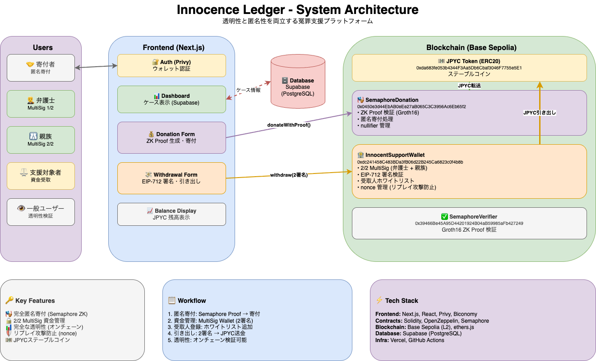
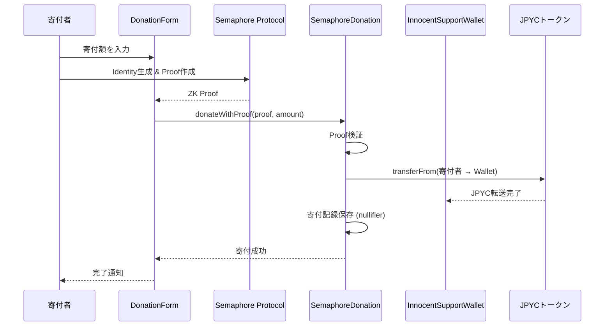
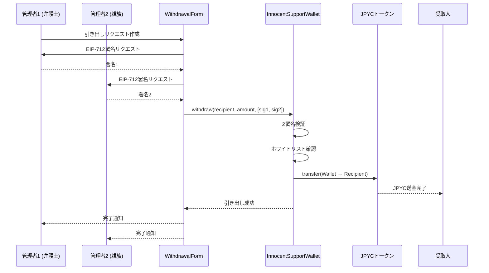
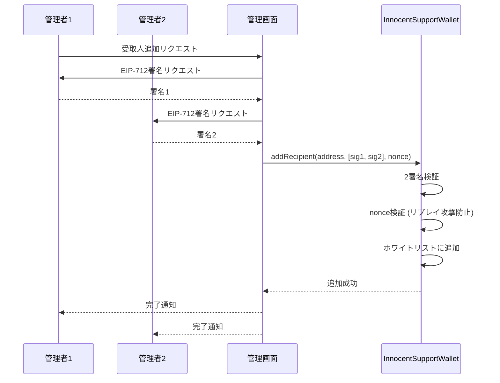

# JPYC_Hackathon_2025

[](https://github.com/mashharuki/JPYC_Hackathon_2025/actions/workflows/ci.yml)

[](https://opensource.org/licenses/MIT)


## Web URL

[Vercel - Web App URL](https://jpyc-hackathon-2025-web-app.vercel.app/)

## プロジェクト概要

**Innocence Ledger** はブロックチェーン技術とステーブルコイン（JPYC）を活用した冤罪被害者への透明性のある支援プラットフォームです。

### 解決する課題

従来の冤罪支援では、以下の問題がありました：

- **透明性の欠如**: 寄付金がどこに・いつ・何に使われたか不明
- **信頼性の問題**: 支援団体への信頼に依存する中央集権的構造
- **資金不足**: 冤罪当事者の社会復帰・再審請求・弁護士費用等の慢性的な資金難
- **プライバシーの懸念**: 寄付者の匿名性が保証されない

### 提供するソリューション

Innocence Ledger は、ブロックチェーンの透明性と Semaphore のゼロ知識証明技術を組み合わせることで、**完全な透明性と完全な匿名性を同時に実現**します。

- ✅ すべての取引がオンチェーンで検証可能
- ✅ ゼロ知識証明による完全匿名寄付
- ✅ MultiSig による安全な資金管理
- ✅ グローバルな支援ネットワーク

## システム概要図



## アーキテクチャ

Innocence Ledger は3つのコアコンポーネントで構成されています：

### 1. **SemaphoreDonation（匿名寄付）**

- Semaphore Protocol による完全匿名寄付
- Groth16 ゼロ知識証明で寄付者のプライバシーを保護
- nullifier により二重寄付を防止
- すべての寄付はオンチェーンで記録・検証可能

### 2. **InnocentSupportWallet（資金管理）**

- 2/2 MultiSig による安全な資金管理
- EIP-712 型付き署名による改ざん防止
- 受取人ホワイトリスト機能
- nonce 管理によるリプレイ攻撃防止

### 3. **Web Application（ユーザーインターフェース）**

- Next.js 16 + React 19 による高速な SPA
- Privy による簡単なウォレット認証
- Supabase によるケース管理
- Biconomy AA によるガスレス・トランザクション対応準備

### データフロー

```
寄付者 → [Semaphore Proof] → SemaphoreDonation → JPYC送金 → InnocentSupportWallet
                                                                        ↓
支援対象者 ← [MultiSig承認] ← WithdrawalForm ← 管理者（弁護士・親族）
```

## 主要な特徴

### 🔒 セキュリティ

| 特徴                  | 技術              | 効果                                       |
| --------------------- | ----------------- | ------------------------------------------ |
| **MultiSig 資金管理** | 2/2署名 (EIP-712) | 単一障害点を排除、資金の不正利用を防止     |
| **リプレイ攻撃防止**  | nonce 管理        | 署名の再利用による不正実行を防止           |
| **型付き署名**        | EIP-712           | 署名内容の明確化、フィッシング対策         |
| **ホワイトリスト**    | 受取人管理        | 承認された支援対象者のみが資金を受け取れる |

### 🕵️ プライバシー

| 特徴               | 技術                   | 効果                         |
| ------------------ | ---------------------- | ---------------------------- |
| **完全匿名寄付**   | Semaphore (Groth16 ZK) | 寄付者の身元を完全に隠蔽     |
| **二重寄付防止**   | nullifier              | 匿名性を保ちながら不正を防止 |
| **オフチェーンID** | Semaphore Identity     | 個人情報をチェーン外で管理   |

### 📊 透明性

| 特徴                 | 技術                 | 効果                           |
| -------------------- | -------------------- | ------------------------------ |
| **オンチェーン記録** | Ethereum (Base L2)   | すべての取引を公開検証可能     |
| **寄付履歴**         | イベントログ         | 資金の流れを追跡可能           |
| **残高確認**         | ERC20 標準           | リアルタイムで残高を確認       |
| **監査可能性**       | スマートコントラクト | コードとデータを誰でも検証可能 |

### 🌍 アクセシビリティ

- **グローバル対応**: 国境を越えた支援を可能に
- **低コスト**: Base L2 によるガス代削減
- **簡単認証**: Privy による簡単ウォレット接続
- **モバイル対応**: レスポンシブデザイン

## 機能一覧表

| 機能カテゴリ   | 機能名                | 説明                                         | 担当コントラクト/コンポーネント        |
| -------------- | --------------------- | -------------------------------------------- | -------------------------------------- |
| **ケース管理** | ケース一覧表示        | 冤罪被害者の支援ケース一覧を表示             | CaseDashboard (Supabase)               |
|                | ケース詳細表示        | 個別ケースの詳細情報、進捗状況、支援額を表示 | CaseDashboardClient                    |
| **匿名寄付**   | Semaphore証明付き寄付 | ゼロ知識証明による完全匿名の寄付機能         | SemaphoreDonation                      |
|                | JPYC寄付              | JPYCトークンを使った寄付                     | DonationForm + SemaphoreDonation       |
|                | 寄付履歴記録          | 寄付のトレーサビリティ確保（匿名性は保持）   | SemaphoreDonation                      |
| **資金管理**   | MultiSigウォレット    | 2署名による安全な資金管理                    | InnocentSupportWallet                  |
|                | 受取人ホワイトリスト  | 支援対象者の登録・管理                       | InnocentSupportWallet                  |
|                | 引き出し機能          | ホワイトリスト登録者への資金送金             | WithdrawalForm + InnocentSupportWallet |
|                | 残高確認              | ウォレット・ユーザーのJPYC残高表示           | BalanceDisplay                         |
| **認証**       | ウォレット接続        | Privy経由のウォレット認証                    | Auth (Privy)                           |
|                | セッション管理        | ログイン状態の管理                           | PrivyProvider                          |

## 機能ごとの処理シーケンス図

### 1. 匿名寄付フロー (Semaphore + JPYC)



### 2. MultiSig引き出しフロー (EIP-712署名)



### 3. 受取人ホワイトリスト管理フロー



## 技術スタック

### スマートコントラクト

| 技術                   | バージョン | 用途                                          |
| ---------------------- | ---------- | --------------------------------------------- |
| Solidity               | ^0.8.23    | スマートコントラクト開発言語                  |
| Hardhat                | ^2.20.1    | 開発環境・テストフレームワーク                |
| ethers.js              | ^6.13.4    | Ethereumライブラリ                            |
| OpenZeppelin Contracts | 5.4.0      | ERC20, EIP-712, ECDSA等の標準実装             |
| EIP-712                | -          | 構造化データの型付き署名 (MultiSig署名)       |
| ECDSA                  | -          | 楕円曲線デジタル署名アルゴリズム (署名検証)   |
| Semaphore Protocol     | 4.14.0     | ゼロ知識証明 (Groth16) によるプライバシー保護 |
| TypeChain              | ^8.3.0     | TypeScript型定義生成                          |

### フロントエンド

| 技術            | バージョン     | 用途                                              |
| --------------- | -------------- | ------------------------------------------------- |
| Next.js         | ^16.1.1        | React フレームワーク (App Router)                 |
| React           | ^19.2.3        | UIライブラリ                                      |
| TypeScript      | ^5             | 型安全な開発                                      |
| Tailwind CSS    | ^3.4.0         | スタイリング                                      |
| Privy           | ^3.10.0        | ウォレット認証・ログイン                          |
| Biconomy        | 4.5.7 / 1.1.20 | Account Abstraction (AA) / スマートアカウント管理 |
| Supabase        | 2.89.0         | データベース (PostgreSQL)                         |
| ethers.js       | ^6.13.4        | ブロックチェーン連携                              |
| Semaphore Utils | 4.14.0         | Identity・Proof生成                               |
| React Hook Form | ^7.62.0        | フォーム管理                                      |
| Zod             | ^3.24.1        | バリデーション                                    |
| React Hot Toast | ^2.6.0         | 通知UI                                            |

### インフラ・デプロイ

| 技術           | 用途                       |
| -------------- | -------------------------- |
| Vercel         | フロントエンドホスティング |
| Base Sepolia   | テストネット (L2 Ethereum) |
| GitHub Actions | CI/CD                      |
| Lefthook       | Git Hooks (lint, format)   |

### テスト・品質管理

| 技術                   | バージョン | 用途                             |
| ---------------------- | ---------- | -------------------------------- |
| Jest                   | ^30.2.0    | ユニットテスト                   |
| @testing-library/react | ^16.3.1    | Reactコンポーネントテスト        |
| Hardhat Test           | -          | スマートコントラクトテスト       |
| Solidity Coverage      | ^0.8.1     | カバレッジ測定                   |
| ESLint                 | ^9.39.2    | 静的解析 (JavaScript/TypeScript) |
| Solhint                | ^6.0.2     | 静的解析 (Solidity)              |
| Prettier               | ^3.2.5     | コードフォーマット               |

## デプロイしたスマートコントラクト

### Base Sepolia (Testnet)

| コントラクト名            | アドレス                                                                                                                      | 説明                                         |
| ------------------------- | ----------------------------------------------------------------------------------------------------------------------------- | -------------------------------------------- |
| **SemaphoreVerifier**     | [0xFA472F6f9529198AFBF55D2e9Ce02C8CCdd92368](https://sepolia.basescan.org/address/0xFA472F6f9529198AFBF55D2e9Ce02C8CCdd92368) | Semaphore ZK Proof検証コントラクト (Groth16) |
| **JPYCトークン**          | [0xda683fe053b4344F3Aa5Db6Cbaf3046F7755e5E1](https://sepolia.basescan.org/address/0xda683fe053b4344F3Aa5Db6Cbaf3046F7755e5E1) | JPYCステーブルコイン (ERC20)                 |
| **InnocentSupportWallet** | [0x3f916bADD44312c30D1C3eb57a37ef3D288009Bc](https://sepolia.basescan.org/address/0x3f916bADD44312c30D1C3eb57a37ef3D288009Bc) | MultiSig資金管理ウォレット (2/2署名)         |
| **SemaphoreDonation**     | [0xabeaFB3246F8460Ab5080f22374645d6edf9D827](https://sepolia.basescan.org/address/0xabeaFB3246F8460Ab5080f22374645d6edf9D827) | 匿名寄付コントラクト (Semaphore統合)         |

## 動かし方

### セットアップ

- 依存関係インストール

  ```bash
  yarn
  ```

- コントラクトの環境変数セットアップ

  ```bash
  cp pkgs/contract/.env.example pkgs/contract/.env
  ```

  **必要な環境変数（`pkgs/contracts/.env`）:**

  ```bash
  # デプロイ用の秘密鍵
  PRIVATE_KEY=your_private_key_here

  # BaseScan API Key (コントラクト検証用)
  BASESCAN_API_KEY=your_basescan_api_key

  # RPC URL
  BASE_SEPOLIA_RPC_URL=https://sepolia.base.org

  # MultiSig Owner アドレス（弁護士・親族）
  OWNER1_ADDRESS=0x...
  OWNER2_ADDRESS=0x...
  ```

- フロントエンドの環境変数セットアップ

  ```bash
  cp pkgs/web-app/.env.example pkgs/web-app/.env.local
  ```

  **必要な環境変数（`pkgs/web-app/.env.local`）:**

  ```bash
  # Privy 認証
  NEXT_PUBLIC_PRIVY_APP_ID=your_privy_app_id

  # Supabase
  NEXT_PUBLIC_SUPABASE_URL=your_supabase_url
  NEXT_PUBLIC_SUPABASE_ANON_KEY=your_supabase_anon_key

  # コントラクトアドレス
  NEXT_PUBLIC_JPYC_TOKEN_ADDRESS=0xda683fe053b4344F3Aa5Db6Cbaf3046F7755e5E1
  NEXT_PUBLIC_SEMAPHORE_DONATION_ADDRESS=0x0450e3d44EbAB0eEe27aB065C3C3956Ac6Eb65f2
  NEXT_PUBLIC_INNOCENT_SUPPORT_WALLET_ADDRESS=0xdc241458C483BDa3fB06d22B245Ca6823c0f4b8b

  # ネットワーク設定
  NEXT_PUBLIC_CHAIN_ID=84532  # Base Sepolia
  NEXT_PUBLIC_RPC_URL=https://sepolia.base.org
  ```

### スマートコントラクト関連

- コンパイル

  ```bash
  yarn contracts run compile
  ```

- テスト

  ```bash
  yarn contracts run test
  ```

- デプロイ

  ```bash
  yarn contracts deploy --logs true --network baseSepolia
  ```

- wallet:addRecipient

  ```bash
  yarn contracts wallet:addRecipient --wallet 0x3f916bADD44312c30D1C3eb57a37ef3D288009Bc --nonce 3 --recipient 0x51908F598A5e0d8F1A3bAbFa6DF76F9704daD072 --logs true --network baseSepolia
  ```

- wallet:removeRecipient

  ```bash
  yarn contracts wallet:removeRecipient --wallet 0x3f916bADD44312c30D1C3eb57a37ef3D288009Bc --nonce 2 --recipient 0x51908F598A5e0d8F1A3bAbFa6DF76F9704daD072 --logs true --network baseSepolia
  ```

- wallet:withdraw

  ```bash
  yarn contracts wallet:withdraw --recipient 0x51908F598A5e0d8F1A3bAbFa6DF76F9704daD072 --amount 1 --network baseSepolia
  ```

- donation:donateWithProof

  ```bash
  yarn contracts donation:donateWithProof --amount 1 --logs true --network baseSepolia
  ```

### フロントエンド関連

- ビルド

  ```bash
  yarn web-app run build
  ```

- 起動

  ```bash
  yarn web-app run dev
  ```

## 動かし方(JPYCv2編)

未対応のブロックチェーンのテストネットで検証する場合には自分で**jpycv2**コントラクトをデプロイする必要がある

`external/jpycv2`フォルダに移動して以下のことを行う

### セットアップ

```bash
cp .env.example .env
```

```bash
npm i
```

### デプロイ

```bash
npm run deploy -- --network baseSepolia
```

### 必要な権限を特定のアドレスに付与

```bash
npm run configure-minter -- --minter 0x51908F598A5e0d8F1A3bAbFa6DF76F9704daD072 --allowance 1000000000000000000000000000 --network baseSepolia
```

### ミント

```bash
npm run mint -- --to 0x51908F598A5e0d8F1A3bAbFa6DF76F9704daD072 --amount 1000 --network baseSepolia
```

### 送金

```bash
npm run transfer -- --to 0x1295BDc0C102EB105dC0198fdC193588fe66A1e4 --amount 5 --decimals 18 --network baseSepolia
```

### Burn

```bash
npm run burn -- --amount 100 --network baseSepolia
```
